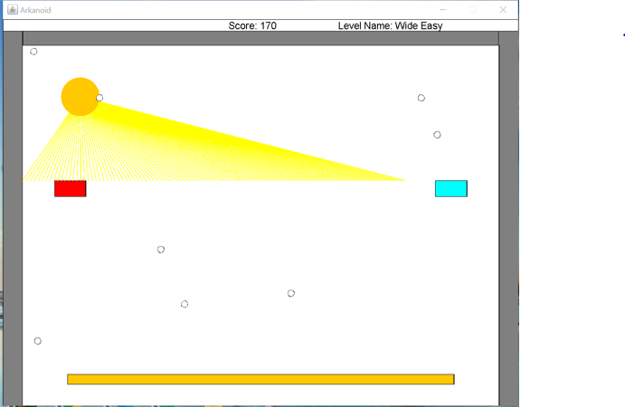
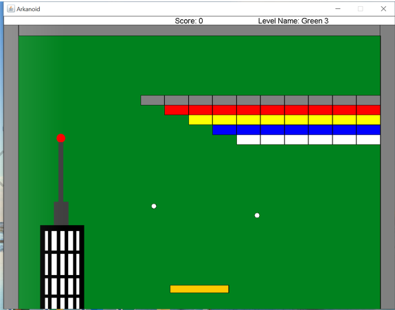
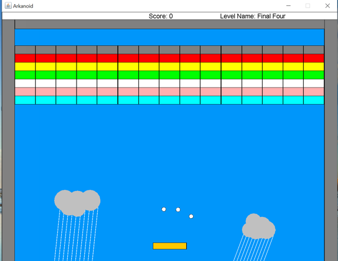
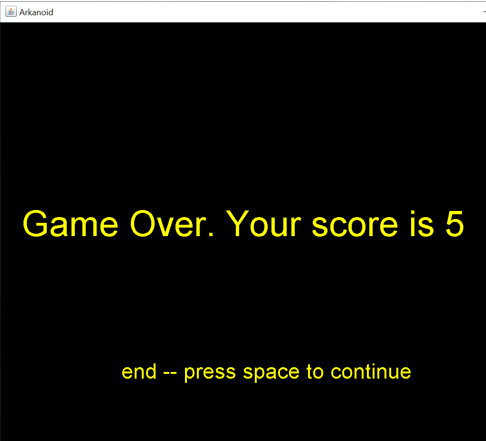

# ArkanoidGame_Java

This project is a computer game for Desktop, developed in Java. 

<kbd>
    
    
    
     
</kbd>

## Getting Started

## Compiling & Running

1. Download the project and open it in Intelij or another IDE.
2. Define a configuration for running and choose the class Ass6Game
3. you need to choose as arguments number between 1 and 4 that will be the serie of levels you want to play
4. First build the project and now you can try yo play!
